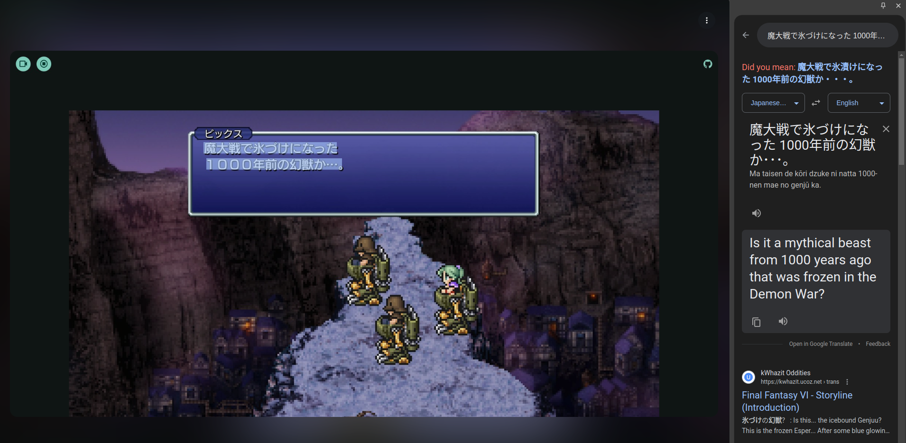

# Dead Simple Screen Capture (DSSC)

Standalone HTML file allowing playback of any window on your desktop. No http server required just open the dssc.html file in Chrome.

## Use Case

DSSC makes it easier to use google lens with native apps. This is useful for practicing languages like Japanese with video games.



## Building

```
npm install
npm run build
```

This will output an html file at `dist/dssc.html`.
